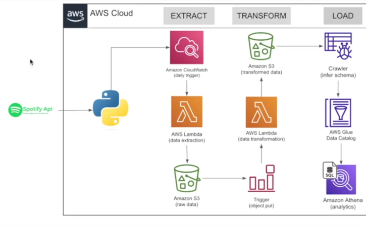
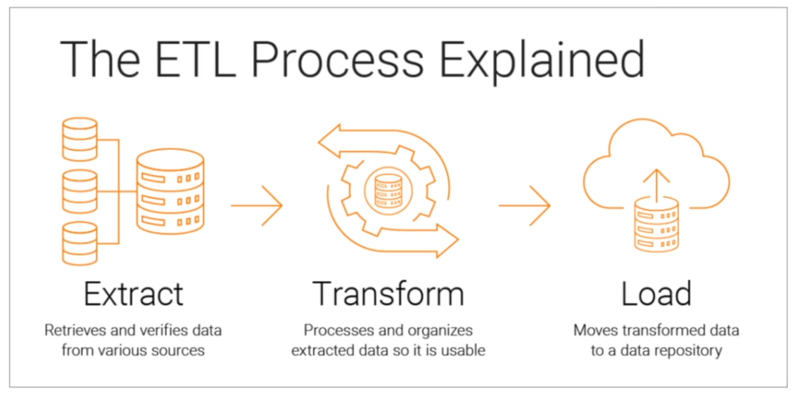

# Spotify Data Analytics | Modern Data Engineering Project

## Introduction
This Project is an end-to-end initiative that harnesses the power of AWS, Jupyter Notebook, and Spotify Developer tools. This project builds a modern data pipeline to extract, process, and analyze Spotify data, delivering valuable insights into music trends, user preferences, and streaming patterns.

## Architecture 

## Technology Used
1. Programming Language - Python
2. AWS Cloud Platform
   - AWS lambda
   - Amazon Athena
   - AWS Glue
   - Amazon S3
   - Amazon CloudWatch
3. Jupyter Notebook
4. Spotify For Developers

**Spotify For Developers: Home** https://developer.spotify.com/

## ETL explanation

**Refer to jupyter Notebook file provided for reference in your learning**
